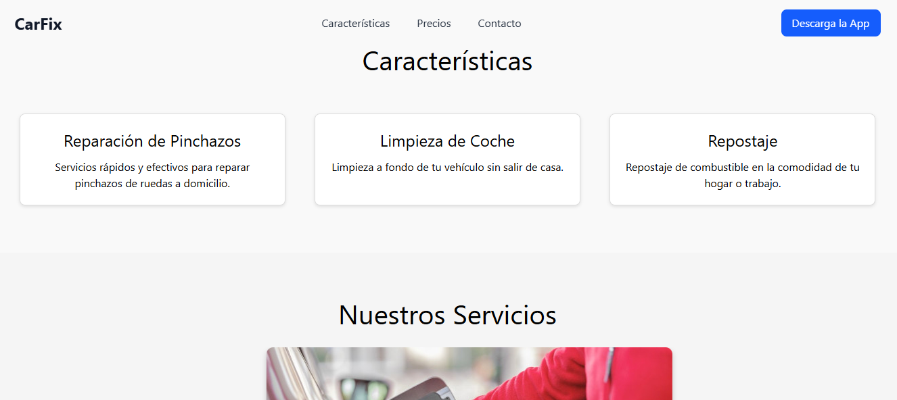
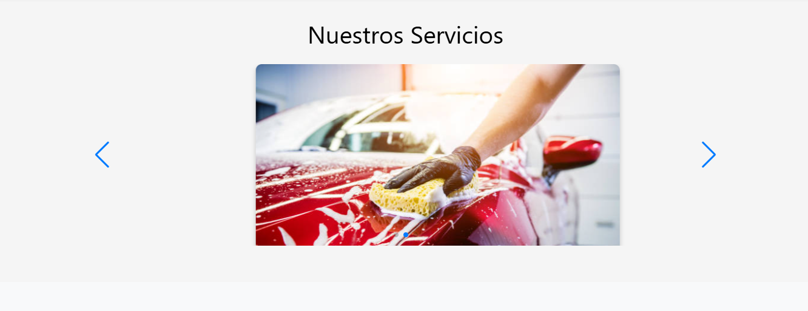
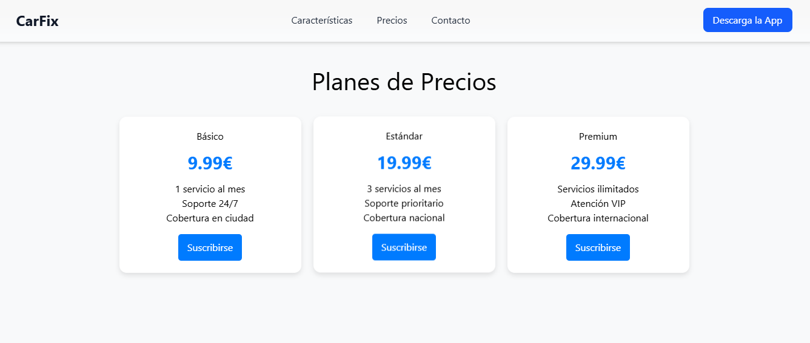
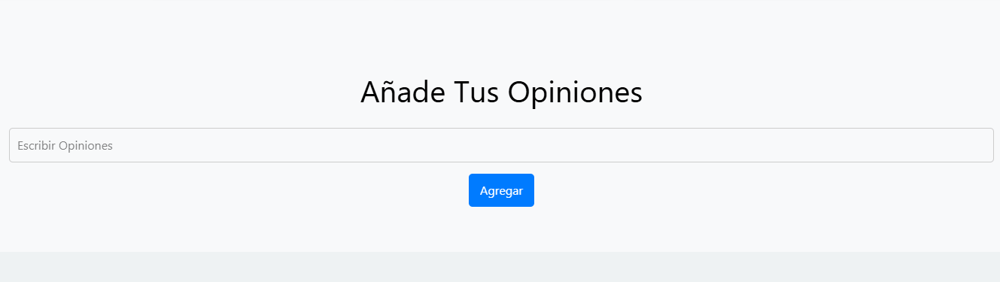
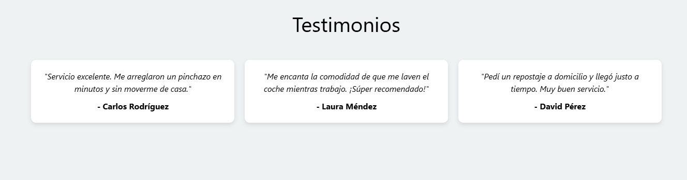
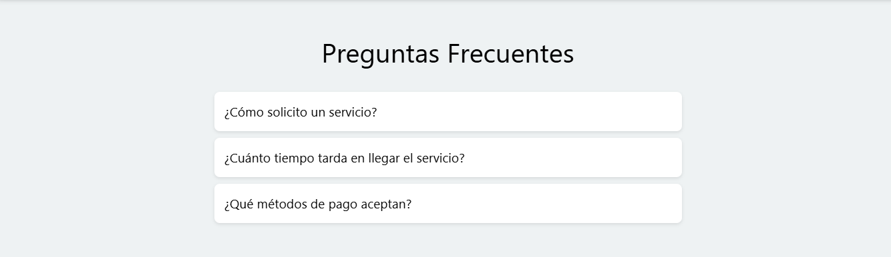
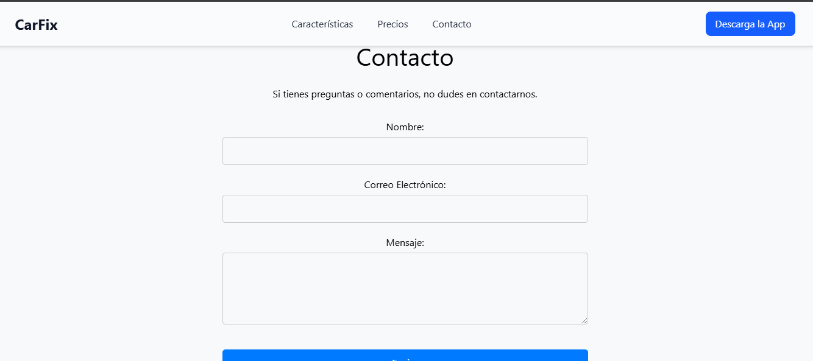

# CarFix - Landing Page

CarFix es una landing page moderna desarrollada con React y Vite. Presenta una aplicación que ofrece servicios para coches, como reparaciones de pinchazos, limpieza y repostaje. La página cuenta con secciones de Características, Precios y Contacto, entre otras.

## 🚀 Tecnologías Utilizadas

- React con Vite
- CSS para el diseño
- Framer Motion para animaciones
- LocalStorage para persistencia de datos

## 📦 Instalación y Ejecución

Sigue estos pasos para ejecutar el proyecto en tu entorno local:

1. **Clona el repositorio:**
   ```bash
   git clone git@github.com:Andrespppp/ProyectoCliente.git
   cd ProyectoCliente
## 📸 Capturas de Pantalla

Aquí hay algunas capturas de pantalla de la aplicación:










# React + Vite

This template provides a minimal setup to get React working in Vite with HMR and some ESLint rules.

Currently, two official plugins are available:

- [@vitejs/plugin-react](https://github.com/vitejs/vite-plugin-react/blob/main/packages/plugin-react/README.md) uses [Babel](https://babeljs.io/) for Fast Refresh
- [@vitejs/plugin-react-swc](https://github.com/vitejs/vite-plugin-react-swc) uses [SWC](https://swc.rs/) for Fast Refresh
